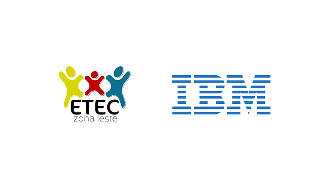

**Portfólio do curso de Desenvolvimento de Sistemas Novotec AMS na ETEC Zona Leste**

**Introdução**

Olá! Seja bem-vindo/a ao meu portfólio, que busca mostrar minha jornada no curso técnico de Desenvolvimento de Sistemas no programa Articulado Médio Superior (AMS) na ETEC Zona Leste. Aqui, você encontrará informações sobre o curso, meu projeto desenvolvido em parceria com uma multinacional da tecnologia e possíveis locais para entrar em contato.

**Sobre o Curso**

O curso de Desenvolvimento de Sistemas na ETEC Zona Leste é uma experiência transformadora que me proporcionou um arsenal de habilidades práticas e teóricas essenciais para a minha carreira. Ao longo do percurso, mergulhei em uma variedade de tecnologias e conceitos fundamentais, o que me preparou para enfrentar os desafios do mundo real.

**Projeto**

Aqui estão alguns dos projetos que desenvolvi durante o curso:

* **Desafio 1:** Elaboração de uma persona para identificar melhor o público alvo, além de palestras sobre o Design Think
* **Desafio 2:** Desenvolvimento de uma identidade única e diferencial para o site
* **Desafio 3:** Criação do front-end de um site de personalização de automóveis
* **Desafio 4:** Criação do do back-end e das funcionálidades do site
* **Desafio 5:** Hospedar o que foi desenvolvido no site <a href='https://br.000webhost.com/'>000webhost</a>

**Contato**

Ficarei feliz em receber feedback ou responder a qualquer pergunta sobre os projetos e aprendizados apresentados aqui. Você pode me contatar através do:

* **E-mail:** nickolasmaraujo@gmail.com
* **Linkedin:** <a href='https://www.linkedin.com/in/nickolas-maia-de-ara%C3%BAjo-134486267/'>Meu Perfil</a>

**Obrigado por explorar meu portfólio!**
